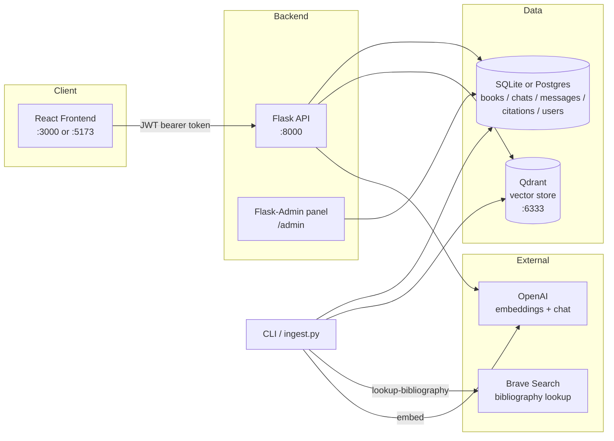
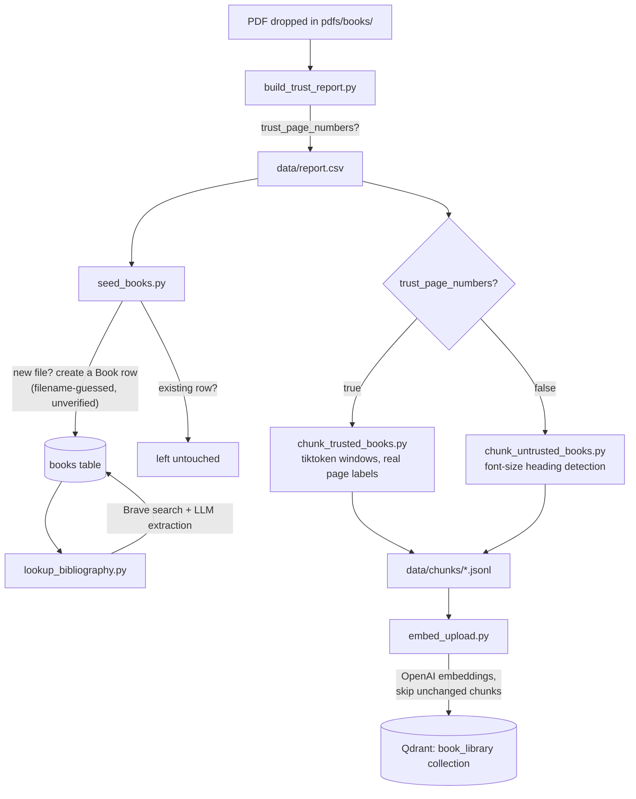
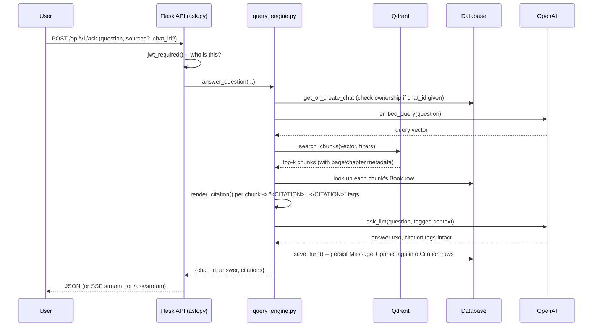
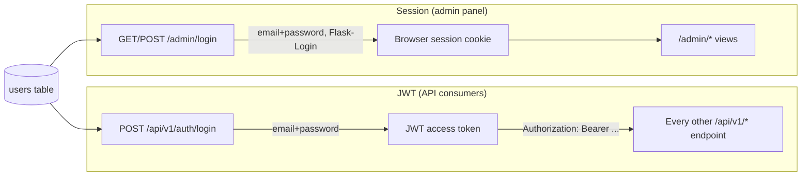
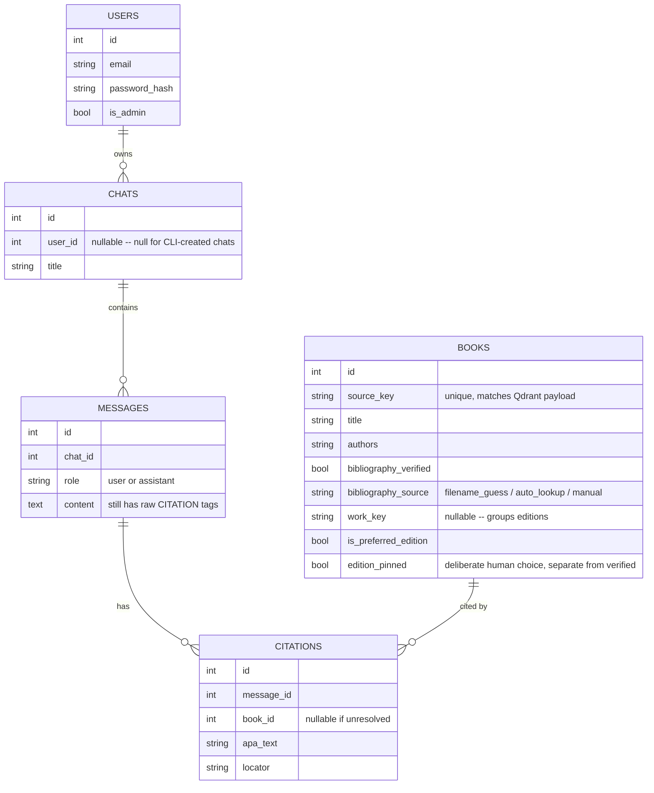
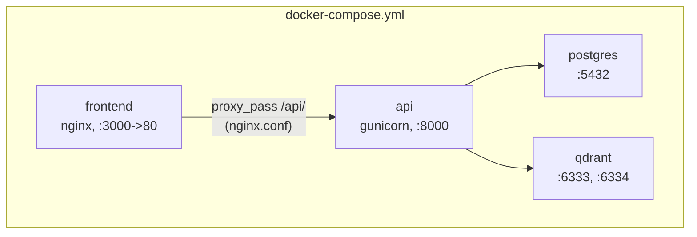

# Book RAG — Architecture

This is the bird's-eye view: what exists, how data moves through it, and
where to start reading code if you want to trace something end to end.
For implementation-level detail on any specific piece, the README is
the source of truth — this document exists to make the *shape* of the
system legible first, since the README's section-by-section detail is
easy to get lost in without a map.

## 1. The system in one picture

Two ways into the system: the **CLI** (`app/cli.py`, or the single-file
`ingest.py` wrapper) does ingestion — turning PDFs into searchable,
cited vectors. The **API** (Flask, behind the React frontend or any
other client) does retrieval — turning a question into an answer. They
share the same database and the same Qdrant collection, but otherwise
don't call into each other.

## 2. Ingestion: PDF → searchable, cited chunk

The fork at "trust_page_numbers?" is the most important decision point
in ingestion, and it's made once, early, by literally checking whether
the PDF's `/PageLabels` metadata exists (`build_trust_report.py`) —
**not guessed**. Everything downstream depends on which path a given
book took:

- **Trusted books** get exact page citations (`p. 47`) because the PDF
  itself told us the real printed page number for every physical page.
- **Untrusted books** (no real page numbers in the PDF at all) get
  chapter/section citations instead (`"Stage 1: Specification" section,
  approx. PDF p.52`), built by detecting headings from font size, since
  there's no real page number to extract.

Both paths converge on the same `data/chunks/<book>.jsonl` format and
get embedded the same way — `embed_upload.py` doesn't know or care which
chunker produced a given file.

**Read these, in order, to understand ingestion fully:**
`app/ingestion/build_trust_report.py` → `seed_books.py` →
`lookup_bibliography.py` → `chunk_trusted_books.py` (and
`chunk_untrusted_books.py` for the no-real-pages case) → `embed_upload.py`.

## 3. Retrieval: question → cited answer

The one subtlety worth internalizing: **the LLM never invents a
citation's content.** Every `<CITATION>...</CITATION>` tag it's allowed
to emit was already built by `render_citation()` *before* the LLM ever
sees the prompt — the model's only job is to copy the exact tag next to
whichever claim it's using. After the answer comes back,
`extract_citation_tags()` parses those tags back out and resolves each
one to a `Book` row for the structured `citations` array the API
returns. This is why citations can't drift from what was actually
retrieved.

**Read these to understand retrieval fully:**
`app/api/v1/ask.py` → `app/retrieval/query_engine.py` →
`app/retrieval/citations.py`.

## 4. Two separate auth systems

This trips people up, so it's worth being explicit: there are **two
independent login flows**, both checking the same `users` table, that
exist for different kinds of clients.

The React frontend (and the CLI's `ask`, sort of — it bypasses auth
entirely, creating ownerless chats) uses the JWT path. `/admin` uses its
own session-based login because it's a traditional server-rendered page,
not a stateless API client — there was no reason to force it through
JWT just for consistency's sake. Chats are scoped to whichever user's
token made the request; a mismatched `chat_id` comes back as 404 (not
403), so a request can't even confirm another user's chat exists.

**Read these:** `app/api/v1/auth.py` (JWT) and `app/admin/views.py`
(session + the actual admin CRUD views, via Flask-Admin).

## 5. Database schema

`Book.source_key` is the join key between this relational data and
Qdrant — every chunk's payload in Qdrant carries a `source` field that
matches a `Book.source_key` exactly. Qdrant itself only stores chunk
text + locator metadata + the embedding vector; it has no idea what a
"book" or "citation" is. All of *that* structure lives here, in
`app/models/`, and gets reattached at query time in
`query_engine.build_context_and_lookup()`.

`work_key`, `is_preferred_edition`, and `edition_pinned` exist
specifically for multi-edition libraries — see the README's "Multiple
editions" section for the full reasoning. The short version: avoid
silently blending two editions of the same book into one answer, while
still letting a human override the automatic year-based choice when they
deliberately want to.

## 6. Where things physically run (Docker topology)

`api`'s `docker-entrypoint.sh` runs migrations and seeds the default
admin on every container start (idempotent after the first boot) before
starting gunicorn. The bare-host path (`uv run python server.py`) skips
all of that — it's meant for local dev, talks to SQLite by default
instead of Postgres, and you run migrations/seeding yourself.

## 7. If you only read five files

In rough order of "how central is this to understanding the system":

1. `app/config.py` — every setting the app reads, in one place. Start
   here to see what's configurable at all.
2. `app/retrieval/query_engine.py` — the actual core loop: embed,
   search, build citations, ask, persist. If you understand this file,
   you understand what the product *does*.
3. `app/models/book.py` and `app/models/chat.py` — the data model. Once
   you know the shape of `Book` and `Chat`/`Message`/`Citation`, most of
   the rest of the codebase is just "code that reads or writes these."
4. `app/cli.py` — the ingestion pipeline as a sequence of named steps;
   reading the `pipeline` command's step list is a faster way to learn
   the ingestion order than reading every ingestion file individually.
5. `app/api/factory.py` — how all the pieces (blueprints, JWT, CORS,
   the admin panel) get wired into one running Flask app.

For anything not covered here, the README is organized the same way
this document is (ingestion, retrieval, auth, frontend, deployment) —
treat this as the table of contents and the README as the chapters.