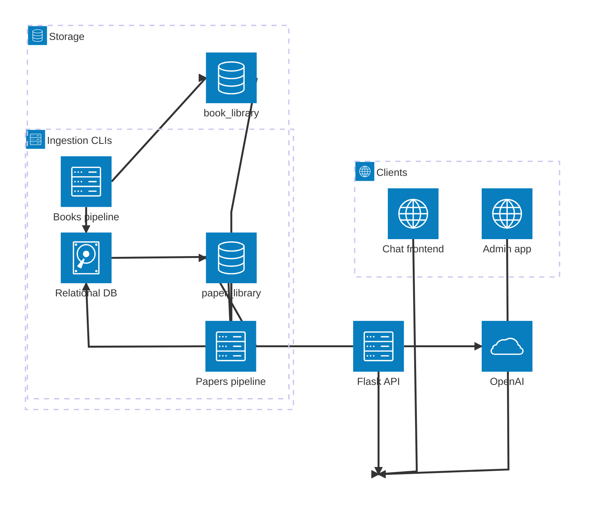

# Book RAG

A research RAG over a personal library: PDFs in, page-accurate (or
chapter/section-accurate, when a document has no real page numbers)
APA-cited answers out, with full chat history persisted to a database,
scoped per logged-in user. Two parallel corpora -- books and papers --
deliberately kept separate end to end (own models, own ingestion
pipeline, own Qdrant collection), queryable independently or together.

## Architecture



The two ingestion CLIs never go through the Flask API at all -- they're
standalone commands that write straight into storage. The API only ever
*reads and writes* storage and calls the LLM; it doesn't ingest
anything itself. `book_library` and `paper_library` are separate Qdrant
collections specifically so a books-only or papers-only question can
never surface noise from the other corpus -- see "Why books and papers
never share a Qdrant collection" below for the full reasoning.

## Folder structure

```
book_rag/
├── .github/workflows/
│   └── tests.yml                  # CI: runs every tests/*.py on push/PR
├── alembic/                       # migrations (Alembic)
│   ├── env.py                     # wired to app.config + app.models
│   └── versions/                  # one file per migration, applied in order
├── alembic.ini
├── app/
│   ├── config.py                  # every setting the app reads, in one place
│   ├── cli.py                     # `python -m app.cli ...` entrypoint
│   ├── logging_config.py          # setup_logging()/get_logger() -- console + rotating JSON file
│   ├── db/
│   │   └── session.py             # SQLAlchemy engine, get_session(), admin scoped session
│   ├── models/
│   │   ├── book.py                 # Book: bibliographic data for APA citations
│   │   ├── paper.py                 # Paper: DOI-anchored bibliographic data for papers
│   │   ├── chat.py                 # Chat / Message / Citation: persisted history (Citation -> Book OR Paper, never both)
│   │   └── user.py                 # User: email/password_hash/is_admin
│   ├── auth/
│   │   ├── security.py             # password hashing (werkzeug.security)
│   │   ├── decorators.py           # admin_required -- real DB lookup, not just a JWT claim
│   │   ├── seed_admin.py           # creates the default admin user
│   │   └── create_user.py          # register a new user, or reset an existing one's password
│   ├── admin/
│   │   └── views.py                # Flask-Admin panel (Users/Books/Papers/Chats), Flask-Login gated
│   ├── ingestion/
│   │   ├── build_trust_report.py   # which books have real page numbers
│   │   ├── chunk_trusted_books.py  # token-chunk books that do
│   │   ├── chunk_untrusted_books.py# font-size heading detection for books that don't
│   │   ├── chunk_cache.py          # shared skip-cache logic, generic over which chunks_dir it's pointed at
│   │   ├── seed_books.py           # create a Book row (filename-guessed) for any new file
│   │   ├── lookup_bibliography.py  # auto-fill book bibliography via Brave Search + LLM
│   │   ├── bibliography_utils.py   # defensive type coercion for bibliography fields
│   │   ├── embed_upload.py         # embed book chunks, upsert into book_library
│   │   ├── seed_papers.py          # create a Paper row (filename-guessed) for any new file
│   │   ├── lookup_paper_doi.py     # auto-fill paper bibliography via DOI (Crossref) -- no LLM needed
│   │   ├── chunk_papers.py         # Docling-based extraction + HybridChunker
│   │   └── embed_upload_papers.py  # embed paper chunks, upsert into paper_library
│   ├── retrieval/
│   │   ├── citations.py            # APA formatting + <CITATION> tag handling, for Book AND Paper
│   │   └── query_engine.py         # embed question -> search (books/papers/both) -> ask -> persist (per-user)
│   └── api/                         # HTTP layer -- versioned, OpenAPI-documented
│       ├── factory.py               # create_app(): Flask + flask-smorest + CORS + JWT + admin + request logging
│       ├── clients.py                # lazy OpenAI/Qdrant client singletons
│       └── v1/
│           ├── schemas.py            # marshmallow request/response schemas
│           ├── auth_schemas.py       # login/me schemas
│           ├── serializers.py        # ORM -> dict, before the session closes
│           ├── books.py              # GET /api/v1/books, /books/<id> (auth required)
│           ├── papers.py             # GET /api/v1/papers, /papers/<id> (auth required)
│           ├── chats.py              # GET/DELETE /api/v1/chats, /chats/<id> (scoped to current user)
│           ├── ask.py                # POST /api/v1/ask, /ask/stream (SSE) (auth required)
│           ├── auth.py               # POST /api/v1/auth/login, GET /api/v1/auth/me
│           ├── admin_users.py        # admin-only user CRUD
│           ├── admin_books.py        # admin-only book bibliography editing
│           ├── admin_papers.py       # admin-only paper bibliography editing
│           └── admin_chats.py        # admin-only chat moderation, across every user
├── scripts/
│   └── extract_isbns.py            # scans pdfs/books/ for ISBNs, writes data/isbns.csv
├── data/
│   ├── report.csv                  # generated by build_trust_report
│   ├── isbns.csv                    # generated by scripts/extract_isbns.py (optional, not part of the pipeline)
│   ├── chunks/                      # generated by chunk_trusted_books / chunk_untrusted_books
│   └── papers/
│       └── chunks/                  # generated by chunk_papers.py
├── logs/
│   └── app.log                     # generated by app/logging_config.py (rotates: app.log.1, .2, ...)
├── pdfs/
│   ├── books/                       # put your book PDFs here
│   └── papers/                      # put your paper PDFs here
├── tests/                          # smoke tests, runnable with no API keys (CI runs all of these)
├── frontend/                        # React + Tailwind chat UI (separate npm project)
│   ├── Dockerfile                   # multi-stage: npm build -> nginx serves the static output
│   ├── nginx.conf                   # serves the SPA, proxies /api/ to the api container
│   └── src/
│       ├── App.jsx                   # auth gate: shows Login or ChatApp
│       ├── ChatApp.jsx                # the main chat UI (what App.jsx used to be, pre-auth)
│       ├── api/client.js             # REST calls, JWT storage, manual SSE stream parsing
│       ├── lib/utils.js              # cn() -- clsx + tailwind-merge, shadcn's signature helper
│       ├── components/
│       │   ├── ui/                   # Button, Badge, Popover, Checkbox, DropdownMenu (shadcn-style)
│       │   ├── Login.jsx              # email/password login screen
│       │   ├── CorpusToggle.jsx       # Books / Papers / Both selector
│       │   ├── MultiSelect.jsx        # Popover+Checkbox+Badge multi-item scope selector (books OR papers, by corpus)
│       │   ├── CitationPanel.jsx      # source detail panel -- renders Book or Paper fields, whichever resolved
│       │   └── ...                   # Sidebar, ChatWindow, MessageBubble, CitationBadge
├── docker-compose.yml              # qdrant + postgres + api + frontend + loki + promtail + grafana
├── promtail-config.yml             # tails logs/app.log, ships to loki
├── grafana-datasources.yml         # auto-provisions Loki as a Grafana datasource on first boot
├── Dockerfile                      # builds the API image (gunicorn inside)
├── docker-entrypoint.sh            # runs migrations, seeds the default admin, starts gunicorn
├── server.py                       # bare-host API entrypoint (waitress)
├── ingest.py                       # single-command books ingestion (report -> seed-books -> ... -> embed)
├── ingest_papers.py                # single-command papers ingestion (seed-papers -> ... -> embed-papers)
├── dev_up.py                       # starts the API + main frontend + admin app together, bare-host
├── migrate_to_cloud.py             # sqlite-to-postgres and qdrant-to-cloud one-off migrations
├── book_rag.db                     # SQLite file (created by `alembic upgrade head`) -- bare-host only
├── pyproject.toml                  # dependencies (managed with uv, not pip)
├── uv.lock                         # locked, reproducible dependency versions
└── .env.example
```

A second, separate project -- a standalone admin SPA -- typically sits as
a sibling folder (`admin/` by default, per `dev_up.py`'s `--admin-path`).
It's deliberately not part of this repo; see "Standalone admin app"
below for what it is and why it's kept separate.

## Setup

```bash
uv sync                # creates .venv and installs everything from uv.lock
cp .env.example .env    # fill in OPENAI_API_KEY at minimum
docker compose up -d --build   # starts Qdrant, Postgres, the API, the frontend, and the logging stack
uv run alembic upgrade head             # only needed for bare-host use -- the api container runs this itself
uv run python -m app.auth.seed_admin    # only needed for bare-host use -- the api container does this itself too
```

`uv` manages the virtual environment for you -- no manual `venv`/`pip install`
step. Every command below runs through `uv run` so it always uses the
locked, reproducible dependency set in `uv.lock` rather than whatever
happens to be on your system Python. Adding a new dependency later is
`uv add <package>`, which updates both `pyproject.toml` and `uv.lock`.

The papers pipeline needs one additional, heavy dependency this repo
doesn't install by default:
```bash
uv add docling
uv add "docling-core[chunking-openai]"
```
Expect a large download -- it pulls a full PyTorch stack (plus
transformers, opencv, scipy) even for CPU-only use, since Docling's
layout-analysis models need it regardless of whether you have a GPU.
Budget several GB of free disk space and real time for the first
install. Nothing else in this project requires it; the books pipeline
and the rest of the API work without it entirely.

`docker compose up -d --build` is the whole stack: Qdrant on `:6333`,
Postgres on `:5432`, the API on `:8000`, the frontend on `:3000`, and the
logging stack (Loki `:3100`, Grafana `:3001`) -- see "Logging &
observability" below. Open `http://localhost:3000` and log in with the
admin credentials printed in the `api` container's logs on first boot --
**`docker compose logs api | grep -A3 "admin user"`** to find them if
you missed them scrolling by. See "Authentication & the admin panel"
below for the full picture, including why you should rotate that
password once you've logged in.

To stop everything: `docker compose down` (data persists in named
volumes). To wipe it and start completely fresh: `docker compose down -v`.

**Prefer running everything bare-host instead of in containers?**
`uv run python dev_up.py` starts the API, the main frontend, and the
admin app together as plain local processes (no Docker at all), with
one Ctrl+C stopping all three cleanly, and opens a browser tab for each
once it's actually ready.

## Pipeline order: books

```bash
uv run python -m app.cli report               # scan pdfs/books/, write data/report.csv
uv run python -m app.cli seed-books            # create a Book row (filename-guessed) for any new file
uv run python -m app.cli lookup-bibliography   # improve unverified books via Brave Search + LLM (needs BRAVE_API_KEY)
uv run python -m app.cli chunk                 # chunk trusted books into data/chunks/*.jsonl
uv run python -m app.cli embed                 # embed chunks, upsert into book_library
uv run python -m app.cli ask "What does Sommerville say about agile methods?"
```

Or run all five as one step: `uv run python -m app.cli pipeline`, or
equivalently `uv run python ingest.py`. Both support `--force`; both
stop immediately with a clear "stopped at step N" message on the first
failure. Without `BRAVE_API_KEY` set, `lookup-bibliography` prints a
message and skips itself cleanly -- the pipeline still completes, books
just keep their filename-guessed bibliography until you set that key or
fix them by hand in `/admin`.

`chunk` and `embed` are both incremental by default -- see "Database:
SQLite or PostgreSQL" below for the manifest mechanics shared with the
papers pipeline. Add `--force` to bypass the skip-cache and reprocess
everything regardless.

`ask` prints a Chat ID -- pass `--chat-id N` on a later call to continue
that same conversation. Pass `--corpus papers` or `--corpus both` to
search the papers library or both libraries at once -- see "Dual-corpus
retrieval" below.

## Pipeline order: papers

```bash
uv run python -m app.cli seed-papers            # create a Paper row (filename-guessed) for any new file
uv run python -m app.cli lookup-paper-doi       # resolve real bibliography via DOI (Crossref) -- no API key needed
uv run python -m app.cli chunk-papers           # Docling-based extraction + chunking into data/papers/chunks/*.jsonl
uv run python -m app.cli embed-papers           # embed chunks, upsert into paper_library
```

Or run all four as one step: `uv run python -m app.cli pipeline-papers`,
or equivalently `uv run python ingest_papers.py`. Same `--force` and
stop-on-first-failure behavior as the books pipeline -- they're
deliberately the same shape so there's nothing new to learn switching
between them.

No `report` step here, unlike books: papers don't have a trusted/
untrusted chunking fork to decide between, since every paper goes
through the same Docling-based pipeline regardless of its own page-
numbering quality.

**Why DOI lookup needs no LLM, unlike book bibliography lookup.** A
book's PDF rarely exposes structured metadata, so `lookup-bibliography`
has to search the web and ask an LLM to extract structured fields from
noisy snippets. A paper, by contrast, almost always prints its own DOI
on the first page or two -- `lookup-paper-doi` finds that string with a
plain regex (preferring a `doi:`/`doi.org/`-labeled match over a bare
one, since a bare DOI-shaped string that early in a paper could belong
to something it cites rather than the paper itself) and resolves it
directly against Crossref's real, structured metadata API. A DOI has no
checksum the way an ISBN does, so resolving it against the real registry
*is* the validation step -- if it doesn't resolve, the script falls back
to a Crossref bibliographic search by title instead, only trusted if the
top result's own title is a close match to what was searched for.

**Why this writes one paper at a time, each in its own transaction.**
`Paper.doi` is a unique database column (papers don't get a filename-
keyed identity the loose way books historically did with ISBN, which
only ever lived in a side-channel CSV) -- and two papers resolving to
the same DOI is a real possibility once this runs across an actual
library: a duplicate PDF, or a preprint and its published version both
correctly resolving to one canonical DOI. With one shared database
transaction for the whole batch, that single conflict would fail at the
final commit and silently roll back *every* paper already processed in
that run, not just the one that collided. Each paper gets its own commit
boundary specifically to prevent that.

## Why books and papers never share a Qdrant collection

Two reasons, not one. The obvious one: a books-only or papers-only
question should never have its retrieved context polluted by the other
corpus, and putting them in one collection would mean every retrieval
call needs a correct `doc_type` filter applied every single time, with
one missed filter anywhere silently leaking the wrong kind of source
into an answer. Separate collections make that failure mode structurally
impossible rather than just less likely.

The less obvious one, and the one that becomes a hard requirement rather
than a preference eventually: a Qdrant collection has one fixed vector
dimension and distance metric for everything in it. If papers ever
warrant a different embedding model, or per-section embeddings at a
different size than whole-chunk embeddings, that's literally impossible
in a shared collection. Separate collections from day one keep that
option open for free, rather than requiring a migration later.

## Dual-corpus retrieval

`search_chunks()`, `answer_question()`, and `answer_question_stream()`
(`app/retrieval/query_engine.py`) all accept a `corpus` parameter:
`"books"` (the default -- every existing caller behaves exactly as
before this existed), `"papers"`, or `"both"`. Since Qdrant has no
cross-collection query, `"both"` runs two real, separate queries and
merges the results by score, truncating back down to `top_k` afterward.
Each retrieved chunk carries an in-memory `_corpus` marker (never written
back to Qdrant) so the citation-building step knows whether to resolve
its source against `Book` or `Paper`, without guessing from a failed
lookup.

Reachable from every entrypoint:
```bash
uv run python -m app.cli ask "..." --corpus papers
uv run python -m app.cli ask "..." --corpus both
```
```json
POST /api/v1/ask/
{"question": "...", "corpus": "both"}
```
Omit `corpus` entirely and it defaults to `"books"`.

Edition exclusion (see "Multiple editions" below) is a books-only
concept -- skipped entirely, not just always empty, when
`corpus="papers"`, so a papers-only question doesn't pay for a `Book`
query that could never affect its results.

## HTTP API

Two ways to run this, both valid depending on what you're doing:

**Bare host, for local dev** (uses `waitress`):
```bash
uv run python server.py              # serves on http://0.0.0.0:8000
uv run python server.py --port 8080  # or pick a different port
```
`waitress` is used here instead of `gunicorn` because `gunicorn` doesn't
run on Windows at all -- it depends on `os.fork`, which Windows doesn't
have.

**Containerized, alongside Qdrant** (uses `gunicorn`):
```bash
docker compose up -d --build
```
This builds the API into its own image (see `Dockerfile`) and runs it as
a service in `docker-compose.yml`. `docker-entrypoint.sh` runs `alembic
upgrade head` and seeds the default admin before starting `gunicorn`.

Swagger UI is at `http://localhost:8000/swagger-ui`, the raw OpenAPI
spec at `/api-spec.json`. Every endpoint is versioned under
`/api/v1/...`.

**Every endpoint below requires auth** -- get a token from
`/api/v1/auth/login` first and send it as `Authorization: Bearer <token>`
on everything else.

| Endpoint | Method | Auth | Purpose |
|---|---|---|---|
| `/api/v1/auth/login` | POST | none | Exchange email + password for a JWT |
| `/api/v1/auth/me` | GET | required | Current user's id/email/is_admin |
| `/api/v1/books/` | GET | required | List every book's bibliographic data |
| `/api/v1/books/<id>` | GET | required | One book by id |
| `/api/v1/papers/` | GET | required | List every paper's bibliographic data |
| `/api/v1/papers/<id>` | GET | required | One paper by id |
| `/api/v1/chats/` | GET | required | List *your* chat threads, most recent first |
| `/api/v1/chats/<id>` | GET | required | Full message history for one of *your* chats |
| `/api/v1/chats/<id>` | DELETE | required | Delete one of *your* chats and its messages |
| `/api/v1/ask/` | POST | required | Ask a question, get the full answer back in one response |
| `/api/v1/ask/stream` | POST | required | Same, but streamed as Server-Sent Events |

See "Admin REST API" below for the `/api/v1/admin/...` endpoints --
listed separately since they all additionally require `is_admin=True`.

Chats are scoped to whichever user's token made the request. The CLI's
`ask` command bypasses all of this entirely (no token involved),
creating chats with no owner -- it's a trusted local tool, not an API
consumer.

`POST /api/v1/ask/` and `/ask/stream` both take the same JSON body:

```json
{"question": "...", "chat_id": null, "sources": null, "top_k": 6, "model": "gpt-5.4-mini", "all_editions": false, "corpus": "books"}
```

only `question` is required. `sources` accepts a list of one or more
book or paper `source_key`s to scope the search to (matches *any* of
them) -- `["bookA"]` for a single source, `["bookA", "bookB"]` for
several, `null` or omitted for the whole corpus. An explicit `sources`
list always wins over the edition-preference exclusion, even if one of
the listed books is a non-preferred older edition. `corpus` is
`"books"` (default), `"papers"`, or `"both"`.

The streaming endpoint emits three event types as plain SSE: one
`chat_id` event immediately, repeated `delta` events as the answer is
generated, and one final `done` event carrying the structured citations
once the full answer is complete.

CORS is wide open by default (`flask-cors` with no restrictions).
Tighten `CORS(app)` in `app/api/factory.py` to specific origins before
this is reachable by anyone but you.

## Authentication & the admin panel

Two separate auth systems, deliberately: the React frontend (and any
other API consumer) uses **JWT bearer tokens** via `/api/v1/auth/login`;
the server-rendered admin panel at `/admin` uses its own **session-based
login** at `/admin/login` (Flask-Login), independent of the JWT system
entirely.

`admin_required` (`app/auth/decorators.py`, used by every
`/api/v1/admin/...` endpoint) re-checks `is_admin` against the database
on every request, rather than trusting the `is_admin` claim baked into
the JWT at login time -- a revoked admin's existing, still-unexpired
token stops working as an admin token on the very next request, instead
of staying valid until natural expiry.

**Default admin user.**
```bash
uv run python -m app.auth.seed_admin
uv run python -m app.auth.seed_admin --email you@example.com
```
Idempotent -- does nothing if an admin already exists. Generates a
cryptographically random 20-character password, printed once to stdout
and never stored anywhere in plaintext.

**Creating additional users.**
```bash
uv run python -m app.auth.create_user --email someone@example.com --password "their password"
uv run python -m app.auth.create_user --email someone@example.com --admin
    # no --password: generates a strong random one and prints it once
uv run python -m app.auth.create_user --email someone@example.com --password "new password" --update
    # the user already exists: reset their password (and --admin status) instead of erroring
```
Without `--update`, creating a user whose email already exists refuses
and tells you to pass `--update` -- never silently overwrites an
existing account.

**The admin panel** (`/admin`, gated to `is_admin=True` users) gives you
Users, Books, Papers (edit bibliography directly -- a quick edit here
writes straight to the database and is automatically marked
`bibliography_verified=True` with `bibliography_source="manual"`; no
delete for either Books or Papers, see "Admin REST API" below for why),
and Chats (view-only, for moderation).

**Secrets.** `.env.example` ships obviously-fake default values for
`JWT_SECRET_KEY` and `SECRET_KEY`. Generate real ones before deploying
anywhere beyond your own machine:
```bash
python -c "import secrets; print(secrets.token_hex(32))"
```

## Admin REST API

The same admin operations the `/admin` panel offers, as JSON endpoints
under `/api/v1/admin/...` -- built specifically so a real frontend (see
"Standalone admin app" below) can drive admin actions without needing to
be a server-rendered page itself. Every endpoint here requires
`admin_required`, on top of the normal `Authorization: Bearer <token>`.

| Endpoint | Method | Purpose |
|---|---|---|
| `/api/v1/admin/users/` | GET | List every user |
| `/api/v1/admin/users/` | POST | Register a new user |
| `/api/v1/admin/users/<id>` | GET | Get one user |
| `/api/v1/admin/users/<id>` | PUT | Update a user (any field optional) |
| `/api/v1/admin/users/<id>` | DELETE | Delete a user |
| `/api/v1/admin/books/` | GET | List every book |
| `/api/v1/admin/books/<id>` | GET | Get one book |
| `/api/v1/admin/books/<id>` | PUT | Update a book's bibliography |
| `/api/v1/admin/papers/` | GET | List every paper |
| `/api/v1/admin/papers/<id>` | GET | Get one paper |
| `/api/v1/admin/papers/<id>` | PUT | Update a paper's bibliography |
| `/api/v1/admin/chats/` | GET | List every chat, **across every user**, with the owner's email attached |
| `/api/v1/admin/chats/<id>` | GET | Full message history for any chat, regardless of owner |
| `/api/v1/admin/chats/<id>` | DELETE | Delete any chat, regardless of owner |

Two safety rules are enforced server-side for users: you can never
delete or demote the *last* remaining admin, and you can't delete your
own account while logged in as it. A duplicate email on user
create/update comes back as a clean 409, not a raw database-constraint
crash.

There's deliberately **no DELETE for books or papers**. Both have real
Qdrant vectors and a chunk file (`data/chunks/<source_key>.jsonl` or
`data/papers/chunks/<source_key>.jsonl`) that nothing in this project
currently cleans up. Deleting just the database row would leave those
chunks orphaned, still searchable, with no row left to resolve their
citation against. The `/admin` panel's `BookAdminView` has the same
restriction (`can_delete = False`) for the same reason. A real "remove a
source" operation means deleting its Qdrant points, its chunk file, and
the row together, atomically -- not built yet.

Editing a book or paper through this API marks it
`bibliography_verified=True` and `bibliography_source="manual"`
automatically, same as the `/admin` panel. `source_key` isn't editable
through either endpoint: it's the join key against Qdrant's chunk
payloads, a structural fact about the ingested file, not bibliography.

## Standalone admin app

A separate React + Vite SPA, deliberately **not part of this repo** --
own `git` history, own `package.json`, own deployment, consuming the
`/api/v1/admin/...` endpoints above. Built on the same actual shadcn/ui
architecture as the main frontend.

Four pages mirroring the REST API one-to-one -- Users, Books, Papers
(list, edit bibliography, no delete, matching the API's own
restriction), and Chats (list across every user with their email shown,
view full message history, delete). Every page has client-side search
and pagination (`useSearchAndPaginate`) -- the admin endpoints return
everything in one response with no server-side paging support, so this
filters and slices in the browser.

It surfaces the backend's own safety messages as-is rather than
re-implementing those rules client-side -- the API is the source of
truth for what's allowed.

To run it alongside this project's own `docker-compose.yml`, drop the
folder in (commonly as `admin/`, which is `dev_up.py`'s default
expectation) and add a service block pointing at its own `Dockerfile`,
depending on `api`, on whatever port isn't already taken.

## Bare-host development

`uv run python dev_up.py` starts the API (`server.py`), the main
frontend, and the admin app together as three plain local processes --
no Docker at all -- with one Ctrl+C stopping all three cleanly, and a
browser tab opened for each frontend once it's genuinely ready to
respond (polled for real, not a guessed delay).

```bash
uv run python dev_up.py
uv run python dev_up.py --admin-path ../book_rag_admin
uv run python dev_up.py --skip-admin
uv run python dev_up.py --skip-frontend
uv run python dev_up.py --no-browser
```

Written as a Python script rather than a shell script specifically so it
runs the same way on Windows as on Linux/macOS. If one service dies on
its own, the script stops every other service too. On Windows, stopping
a service uses `taskkill /F /T` -- killing the whole process tree, since
`npm run dev` spawns child Node processes that a plain terminate of the
parent can leave orphaned.

## Logging & observability

`app/logging_config.py`'s `setup_logging()` is called once by every
entrypoint -- safe to call more than once, it no-ops after the first
call. Two outputs: plain text to stdout, and structured JSON to a
rotating file at `logs/app.log` (`LOG_MAX_BYTES` default 10MB,
`LOG_BACKUP_COUNT` default 5 old files kept beyond the current one).

Every API request is logged automatically with `method`, `path`,
`status`, and `duration_ms` as real structured JSON fields.

**Exposing logs to Grafana.** `docker-compose.yml` includes `loki`,
`promtail`, and `grafana`. Open `http://localhost:3001`, log in (`admin`
/ whatever `GRAFANA_ADMIN_PASSWORD` is set to), go to **Explore**, and
query `{job="book_rag_api"}` -- or `{job="book_rag_api"} | json | status >= 400`
to filter straight to errors.

One honest caveat about the tools themselves: Grafana's own
documentation describes Promtail as feature-complete/maintenance-mode,
with **Grafana Alloy** as the actively-developed replacement going
forward. Promtail was used here anyway because its config is
dramatically simpler for a first pass, and it's still fully functional.

## Database: SQLite or PostgreSQL

SQLite by default for bare-host `uv run` use, Postgres for the
Dockerized path. Both are driven by the exact same `DATABASE_URL`-based
config and the exact same Alembic migrations -- every migration in this
project has been verified against a real local Postgres instance during
development, not just SQLite. Every migration that adds a `NOT NULL`
column also sets a `server_default` for the `ALTER TABLE` itself, then
drops it immediately after -- without this, a fresh install's empty
tables would hide a bug that only bites on a real upgrade against a
database that already has rows in it.

`chunk`/`chunk-papers` and `embed`/`embed-papers` are all incremental by
default, via the same shared skip-cache module
(`app/ingestion/chunk_cache.py`) -- it takes an explicit `chunks_dir`
parameter so the books and papers pipelines each get their own manifest
file (`data/chunks/.manifest.json` and `data/papers/chunks/.manifest.json`)
without colliding, while books' existing callers (which pass no
argument) keep behaving exactly as before that parameter existed. This
matters in practice: without it, adding one new item to a 500-item
library would silently re-chunk and re-embed all 500, including real
OpenAI cost for chunks that never changed.

**Moving an existing SQLite database to Postgres, or a local Qdrant
collection to a hosted one:** `migrate_to_cloud.py` at the project root
handles both, as two subcommands -- see the script's own `--help` for
exact usage. The SQLite-to-Postgres path resets Postgres's identity
sequences after copying, since otherwise the very next normal insert
would collide with a migrated row's explicit id. The Qdrant path uses
`qdrant_client`'s own official `migrate()` helper, not a hand-rolled
scroll/upsert loop.

## Continuous integration

`.github/workflows/tests.yml` runs every file in `tests/` on every push
and PR to `main`. Most tests are fully self-contained -- synthetic
fixtures, no real books or papers needed -- but a few specifically
exercise real PDF text extraction against the actual files used during
development, which are correctly never committed to this repo
(copyright). Those detect the file's absence, print a `[skip]` line, and
exit 0 rather than fail -- expected in CI, not a bug.

## Frontend

```bash
cd frontend
npm install
npm run dev      # http://localhost:5173, proxies /api/* to localhost:8000
```

A React (plain JS, not TypeScript) + Tailwind v4 single-page app, built
on the actual shadcn/ui architecture rather than just visually imitating
it: real Radix UI primitives, `class-variance-authority`, `clsx` +
`tailwind-merge`, HSL CSS-variable theming.

**Corpus selection.** A `CorpusToggle` (Books / Papers / Both) sits next
to the book/paper scope picker. `MultiSelect` needed no new logic to
support papers -- `Book` and `Paper` already share the same
`id`/`title`/`source_key` shape, so it just takes whichever list matches
the current corpus. When corpus is "both," the scope picker steps aside
entirely rather than show something confusing, since there's no single
list left to scope to. Switching corpus clears any selected sources,
since the available items differ per corpus.

**Citations.** `CitationPanel` resolves `paper_id` the same way it
already resolved `book_id` -- a citation carries at most one of the two,
mirroring the backend's own `Citation` model exactly -- and renders
venue/DOI/abstract for a paper instead of publisher/edition for a book.

**ChatGPT-style layout.** A chat history sidebar on the left, the active
conversation in the middle, and a right-hand panel that opens when a
citation badge is clicked. User messages are right-aligned colored
bubbles; assistant messages have no bubble at all, matching ChatGPT's
actual treatment rather than just approximating it.

Answers render as real markdown (`react-markdown` + `remark-gfm` +
`rehype-raw` + `@tailwindcss/typography`). The chat response text still
contains raw `<CITATION>...</CITATION>` tags when it reaches the
frontend -- `react-markdown`'s `components` prop overrides the
(lowercased) `citation` element to render the real `CitationBadge`
component inline, matching each one against the structured `citations`
array by exact text match. The streaming endpoint can't use the
browser's native `EventSource` (GET-only) since `/ask/stream` is a POST
-- `client.js` reads the raw `fetch()` response stream by hand instead.

## Citations

Every retrieved excerpt is given a ready-made APA in-text citation and
handed to the LLM pre-wrapped in `<CITATION>...</CITATION>` tags. After
the answer comes back, every tag is parsed out and saved as a `Citation`
row linked to the `Message` and -- when resolvable -- either a `Book` or
a `Paper`, never both (`book_id` and `paper_id` are both nullable on the
same row, mutually exclusive in practice; kept as one shared table
rather than a separate `PaperCitation` model specifically because a
single answer can cite both corpora, and `order_index` needs to reflect
the true order citations appeared in regardless of which one each came
from -- splitting into two tables would mean merge-sorting two queries
just to render one message's citations correctly).

Papers get real APA multi-author rules, which books' simpler
first-author-only logic doesn't need to handle: one author -> surname;
two -> "A & B"; three or more -> "A et al." Locators prefer a real page
number (most paper chunks carry one, via Docling's own per-element
provenance) and fall back to the section heading only when Docling
couldn't anchor a chunk to a specific page at all.

## Database schema changes

This project uses Alembic, not `Base.metadata.create_all()`.
```bash
# edit a model in app/models/, then:
uv run alembic revision --autogenerate -m "describe the change"
uv run alembic upgrade head
```
If the new column is `nullable=False`, check the generated migration
adds a `server_default` for the `ALTER TABLE` step (and drops it again
right after) -- see "Database: SQLite or PostgreSQL" above for why.

## Multiple editions of the same book

If your library has more than one edition of the same title, give both
books the same `work_key` in `/admin` -- `seed-books` then automatically
marks the highest-`year` book in that group as the preferred edition.
Check both `is_preferred_edition` and `edition_pinned` to deliberately
pin a specific edition regardless of year. `edition_pinned` is
intentionally separate from `bibliography_verified` -- a book's
bibliographic data being correct and a human having deliberately chosen
it over its siblings are different facts.

`ask` only searches preferred editions by default -- pass
`--all-editions` to search every edition, or `--source <file>`
(repeatable) to pin specific ones directly. This concept doesn't exist
for papers yet -- a preprint and its published version aren't currently
linked the way book editions are.


Run a new migration: `uv run alembic revision --autogenerate -m "message"`
Migrate: `uv run alembic upgrade head`

Run celery tasks: `uv run celery -A app.worker.celery_app worker --loglevel=info --pool=solo`

uv run python scripts/cross_check_verification.py --document-id 1
uv run python scripts/cross_check_verification.py --document-id 1 --verdicts contradicted supported